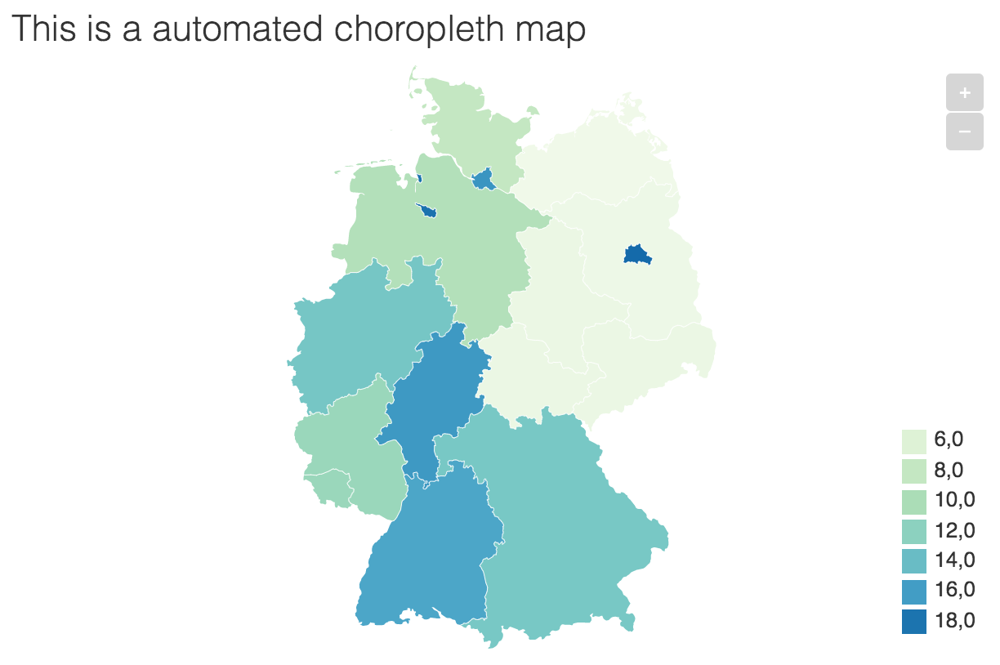
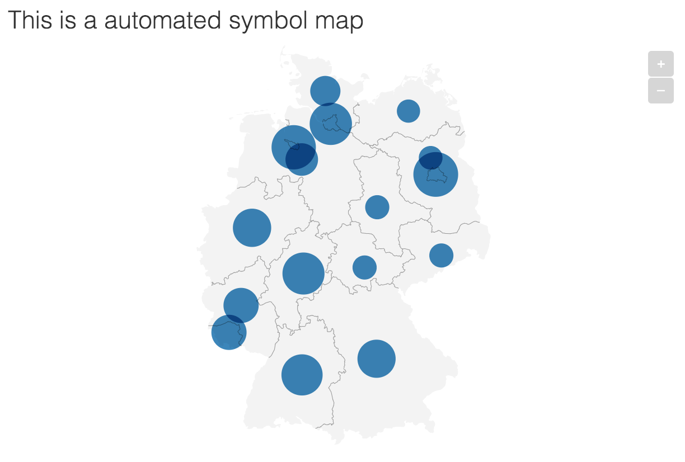

```{r, include = FALSE}
knitr::opts_chunk$set(
  collapse = TRUE,
  comment = "#>"
)

library(DatawRappr)
library(dplyr)
```

There will probably be a function to create a map in one run in the next major version of {DatawRappr}. In the meantime, I wrote this tutorial:

There are three map types in Datawrapper: locator, symbol and choropleth. I'm trying to explain in short, how you can use DatawRappr to create a map programmatically in symbol and choropleth. And as an add-on: How to create a tooltip using {DatawRappr}.

The basic steps are always the same:

+ Create a new chart with chart-type `map`.
+ Upload your data to this chart/map with the required columns (IDs or Lat/Long-coordinates).
+ Edit the chart to select the matching for the columns.
+ Publish the chart.

If you want to update the data, you will only need steps 2 and 4.

***

# Create a Choropleth map

## Create a new chart

You can use this code to create a new chart and save the chart to your current environment. You don't have to save it. You will just need the chart-id later.

```{r}
new_choropleth_chart <- dw_create_chart(
  title = "This is a automated choropleth map", 
  type = "d3-maps-choropleth"
  )
```

## Upload data to the chart

We will now upload some data to our newly created map. Beforehand, we have to decide on an basemap and a key that maps the data to the chart.

### Select the right map

Datawrapper provides an API-endpoint with their basemaps, which you might `curl`

```{bash eval = FALSE}
curl --request GET \
  --url https://api.datawrapper.de/plugin/basemaps
```

Or you can use the built-in dataframe in DatawRappr:

```{r}
head(dw_basemaps)
```

First, you have to decide, which map to use. It is identified by the `id`-column.

You can use dplyr's `View()` to get an interactive table. Or you might want to filter using `grepl()`

```{r}
dw_basemaps %>% 
  filter(grepl("us-nyc", id))
```

### Select the right key

In a second step, you have to choose a key for the map, which is identified in `value`. `label` and `description` provide some more details about it.

The key is the variable that binds the data to the map.

```{r}
dw_basemaps %>% 
  filter(grepl("germany-nuts3", id))
```

In this example the basemap `germany-nuts3` offers two key-options: `NUTS_ID` and `NUTS_NAME`. If you already have one of these options in your dataset, select the right one. 

Otherwise, you will have to wrangle the data anyway.

***

**Getting Country IDs**

You can easily transform country names in German or English with the [{countrycode}](https://cran.r-project.org/web/packages/countrycode/)-package. In most cases you won't need a manual translation table.
Simply add a column with something like 
`countrycode::countrycode(sourcevar = SOURCE VARIABLE, origin = "country.name.de", destination = "iso3c")`
to your dataframe.

***
Just in case you need it: You can retrieve the expected keys for a basemap by calling this API-endpoint. Simply enter the `id` of the basemap and the `value` of the key:

```{bash eval = FALSE}
curl --request GET \
  --url https://api.datawrapper.de/plugin/basemaps/ID/VALUE
```

you could also use the {jsonlite}-package for this task:

```{r}
library(jsonlite)

r <- fromJSON("https://api.datawrapper.de/plugin/basemaps/germany-states/name")
r$data$values
```

### Upload the data 

We are using a simple dataset for German States here as an example: It contains the share of foreign population per German federal state ([source: Federal Statistical Office Germany (Destatis)](https://www.statistikportal.de/de/bevoelkerung/auslaendische-bevoelkerung)).

```{r}
df_foreign_pop <- read.csv("data/foreign_pop.csv", stringsAsFactors = FALSE)

str(df_foreign_pop)
```

You can simply upload the data as you would do with any other {DatawRappr}-chart.

```{r}
dw_data_to_chart(df_foreign_pop, chart_id = new_choropleth_chart)
```

## Set the keys in the metadata

The metadata of a chart gives us the full flexibility to change what we want to change. In this case, we have to set the axes. A chart in Datawrapper returned as a JSON-Object, which contains differents sublevels. One of those is called *metadata* and contains the relevant keys:

```
"metadata": {
      "axes": {
          "keys": "KEY FROM DATA",
          "values": "VALUE FROM DATA"
      },
      "visualize": {
          "basemap": "ID of the basemap",
          "map-key-attr": "VALUE of the map key"
      }
}    
```

In our example from above, we are using the names of the German federal states as the IDs. We will therefore use the basemap *germany-states* with the value *name*. *name* consists of the keys that are already present in our dataset in the _state_-column. So we don't need any transformation here. We just need to tell Datawrapper which column to use.

```{r}
dw_edit_chart(new_choropleth_chart, 
              axes = list(
                keys = "state", 
                values = "share_foreign_population"
                ), 
              visualize = list(
                basemap = "germany-states", 
                "map-key-attr" = "name"
                )
              )
```

At that point, you might want to switch to Datawrapper's UI to make the final adjustments to the legend before publishing. But: You could do them via `dw_edit_chart` as well. It's probably just not that much fun.

## Publish the chart

This is probably the easiest part:

```{r}
dw_publish_chart(new_choropleth_chart)
```

```{r include=FALSE}
# deleting chart as this file is just for demo purposes
dw_delete_chart(new_choropleth_chart)
```



***

# Create a Symbol map

A symbol map maps a certain value to a geographic location. We will use predefined coordinates here. Datawrapper's user interface allows geocoding of adresses.

The workflow is pretty similar to the choropleth map. The main difference: We will use Latitude and Longitude coordinates, instead of the key.

## Create a new chart

You can use this code to create a new chart and save the chart to your current environment. You don't have to save it. You will just need the chart-id later.

```{r}
new_symbol_chart <- dw_create_chart(
  title = "This is a automated symbol map", 
  type = "d3-maps-symbols"
  )
```

## Upload data to the chart

We will now upload some data to our newly created map. Beforehand, we have to decide on an basemap.

### Select the right map

Datawrapper provides an API-endpoint with their basemaps, which you might `curl`

```{bash eval = FALSE}
curl --request GET \
  --url https://api.datawrapper.de/plugin/basemaps
```

Or you can use the built-in dataframe in {DatawRappr}:

```{r}
head(dw_basemaps)
```

First, you have to decide, which map to use. It is identified by the `id`-column.

You can use dplyr's `View()` to get an interactive table. Or you might want to filter using `grepl()`

```{r}
dw_basemaps %>% 
  filter(grepl("us-nyc", id))
```

### Upload the data 

We are using a simple dataset for German States here as an example: It contains the share of foreign population per German federal state ([source: Federal Statistical Office Germany (Destatis)](https://www.statistikportal.de/de/bevoelkerung/auslaendische-bevoelkerung)).

```{r}
df_foreign_pop_symbol <- read.csv("data/foreign_pop_symbol.csv", stringsAsFactors = FALSE)

str(df_foreign_pop_symbol)
```

The data is already geocoded into the *Lat* and *Lon*-columns. They are required for the symbol map.

***

**Geocoding Adresses**

There are loads of resources on how to geocode places with R. For example, you might want to check out the [{ggmap}](https://github.com/dkahle/ggmap)-package. Unfortunately geocoding with Google does require an API-Key.

For open alternatives you might have a look at [hrbrmstr's {nominatim}](https://github.com/hrbrmstr/nominatim) or the `geocode_OSM()`-function in [{tmaptools}](https://github.com/mtennekes/tmaptools).

***

With Lat and Lon-columns set, you can simply upload the data as you would do with any other {DatawRappr}-chart.

```{r}
dw_data_to_chart(df_foreign_pop_symbol, chart_id = new_symbol_chart)
```

## Set the keys in the metadata

The metadata of a chart gives us the full flexibility to change what we want to change. In this case, we have to set the axes. A chart in Datawrapper returned as a JSON-Object, which contains differents sublevels. One of those is called *metadata* and contains the relevant keys:

```
"metadata": {
        "axes": {
            "lat": "Lat-Col",
            "lon": "Lon-Col",
            "area": "Value-Col",
            "values": "Value-Col"
        },
      "visualize": {
          "basemap": "world-2019"
      }
}
```

In our example from above, we are using the names of the German federal states as the IDs. We will therefore use the basemap *germany-states*. We just need to tell Datawrapper which basemap and columns to use for the mapping. Further options in `axes` would be: 

* `area`: for the area/size of the symbol
* `value`: for the color of the symbol

```{r}
dw_edit_chart(new_symbol_chart, 
              axes = list(
                lat = "Lat", 
                lon = "Lon",
                area = "share_foreign_population"
                ), 
              visualize = list(
                basemap = "germany-states"
                )
              )
```

At that point, you might want to switch to Datawrapper's UI to make the final adjustments to the legend before publishing. But: You could do them via `dw_edit_chart` as well. It's probably just not that much fun.

## Publish the chart

This is probably the easiest part:

```{r}
dw_publish_chart(new_symbol_chart)
```


```{r include=FALSE}
# deleting chart as this file is just for demo purposes
dw_delete_chart(new_symbol_chart)
```



***

# TBC: Create a Locator map

Locator-maps are a little tricky and probably not so heavily automated than choropleths and symbols. That's why I decided place this section a little lower on my priority list.

***

# Including tooltips

Including a tooltip is a task that is not only useful for maps, but also for scatterplots. The way to change them via tha API are pretty easy. Just use the `visualize`-argument in `dw_edit_chart()`: Add a list which includes another list called `tooltip`.

tooltip has three different keys:

* body: which is the body text of the tooltip. Add double brackets ton include a variable: `{{ variable }}`.
* title: is the title of the tooltip. It may also contain a variable with double brackets.
* fields: is a list that contains the mapping between the chart data and the variables in the tooltips. You have to include each variable here that is used in the tooltip double brackets. You may (although it makes things more complicated) map variables differently, as shown below where `"name" = "b"`.

```{r eval=FALSE}
dw_edit_chart(CHART_ID, visualize = list(
  tooltip = list(
    body = "{{ name }} has value {{ a }}.",
    title = "{{ name }}",
    fields = list(
      "name" = "b",
      "a" = "a"
    )
    )))
```


